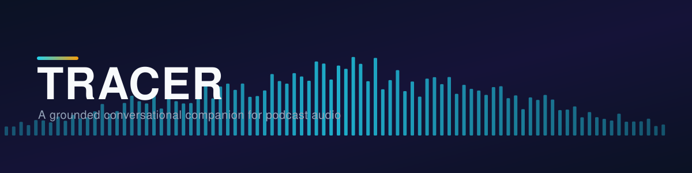
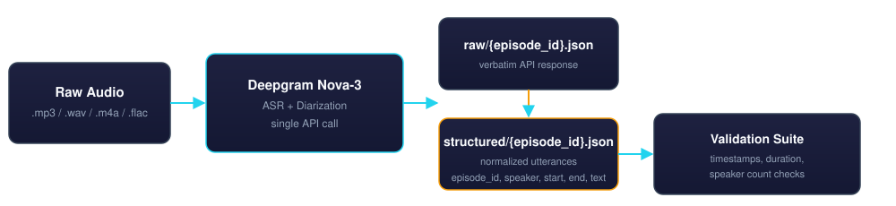

<div align="center">



<br/>


</div>

<br/>

**Tracer turns raw podcast audio into clean, timestamped, speaker-labeled transcripts** — the traceable foundation everything downstream is built on. Point it at a folder of audio files and it hands back structured, validated JSON with exact `start`/`end` timestamps for every line spoken.

This repository currently implements the **transcription stage** of the pipeline: audio in, structured transcript out.

<br/>

## How it works



Each audio file is sent to Deepgram's **Nova-3** model in a single API call with diarization enabled — no separate ASR and speaker-diarization systems to stitch together. The raw API response is saved verbatim, then normalized into a clean per-utterance schema and run through a validation suite before it's considered done.

<br/>

## What's implemented

| | |
|---|---|
| **Single-call ASR + diarization** | One request per episode to Deepgram Nova-3 (`diarize`, `punctuate`, `smart_format`, `utterances` all enabled) |
| **Raw + structured separation** | The verbatim API response is saved independently of the normalized output, so parsing logic can be fixed later without re-spending API budget |
| **Idempotent runs** | Episodes that already have structured output are skipped automatically; `--force` overrides |
| **Retry with backoff** | Network errors, timeouts, and `429` responses retry with exponential backoff; `4xx` errors stop immediately and print the full response |
| **Automated validation** | Every structured transcript is checked for monotonic timestamps, valid start/end ordering, duration accuracy, and speaker coverage before being accepted |

<br/>

## Dataset

Four episodes have been transcribed and validated so far:

| Episode | Duration | Utterances | Speakers |
|---|---|---|---|
| Great Papers 01 — Einstein's Special Relativity | 52m 14s | 790 | 2 |
| Great Papers 02 — How Black Holes Radiate (Hawking, 1975) | 45m 17s | 677 | 2 |
| Great Papers 03 — The Double Helix (Watson & Crick, 1953) | 43m 16s | 656 | 2 |
| Great Papers 04 — Shannon and the Birth of Information (1948) | 39m 52s | 588 | 2 |
| **Total** | **~3h 1m** | **2,711** | — |

<br/>

## Getting started

**Prerequisites:** Python 3.10+, a [Deepgram](https://deepgram.com) API key.

```bash
pip install -r requirements.txt
```

Add your key to `.env`:

```
DEEPGRAM_API_KEY=your_key_here
```

Run the pipeline:

```bash
python src/transcribe.py
```

That's the entire setup — one command, no manual steps. Audio files are read from `/data`; output is written to `/transcripts`.

### Options

| Flag | Default | Description |
|---|---|---|
| `--input-dir` | `data` | Directory to read audio files from |
| `--output-dir` | `transcripts` | Directory to write `raw/` and `structured/` output into |
| `--force` | off | Re-transcribe even if structured output already exists |

<br/>

## Output

```
transcripts/
  raw/{episode_id}.json          verbatim Deepgram API response
  structured/{episode_id}.json   normalized transcript
```

Each structured file:

```json
{
  "episode_id": "great_papers_01_einstein_s_special_relativity",
  "source_file": "Great Papers 01 - Einstein's Special Relativity.mp3",
  "model": "nova-3",
  "duration_seconds": 3134.01,
  "generated_at": "2026-09-09T21:48:32Z",
  "utterances": [
    {
      "utterance_id": "great_papers_01_einstein_s_special_relativity_u0002",
      "speaker": "SPEAKER_0",
      "start": 2.0,
      "end": 7.12,
      "text": "A 26 year old is examining patent applications at a desk in Bern,",
      "confidence": 0.9817
    }
  ]
}
```

| Field | Description |
|---|---|
| `episode_id` | Derived from the filename — lowercase, extension stripped, special characters replaced with underscores |
| `duration_seconds` | Taken directly from Deepgram's response metadata |
| `utterance_id` | `{episode_id}_u{4-digit index}`, sequential in time order |
| `speaker` | Deepgram's speaker index, normalized to `SPEAKER_0`, `SPEAKER_1`, ... |
| `start` / `end` | Seconds from the start of the episode |

<br/>

## Validation

Every structured transcript is checked automatically before it's accepted:

| Check | What it catches |
|---|---|
| Non-empty utterance list | An episode that produced no transcript at all |
| Monotonic timestamps | Out-of-order segments from a parsing bug |
| `start < end` on every utterance | Malformed time ranges |
| Duration cross-check | Reported duration vs. actual audio file length (via `mutagen`), flagged if they diverge by more than a few seconds |
| Speaker coverage | Warns if diarization returned only one speaker |

<br/>

## Project structure

```
.
├── assets/                  README graphics
├── data/                    raw audio input (gitignored, read-only)
├── transcripts/
│   ├── raw/                 verbatim Deepgram responses (gitignored)
│   └── structured/          normalized transcripts (gitignored)
├── src/
│   └── transcribe.py        pipeline entrypoint
├── .env.example
├── requirements.txt
└── README.md
```
